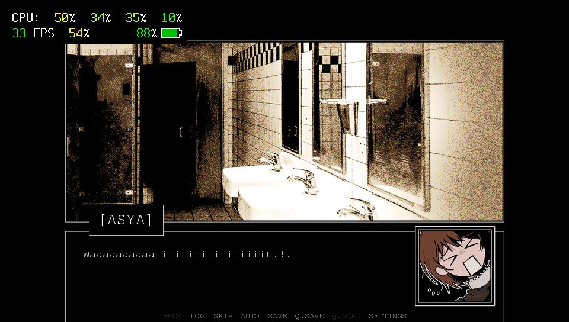

# Z.A.T.O. // I Love the World and Everything In It - PS Vita Port

[中文版](README_CN.md)



PS Vita porting scripts for Z.A.T.O. // I Love the World and Everything In It.

## Dependencies

- Python 3.7+
- Pillow >= 9.0.0
- Other dependencies will be automatically checked and installed by the scripts

## Usage Instructions

### Step 1: Prepare Game Files on PC

1. Install [Z.A.T.O. // I Love the World and Everything In It](https://store.steampowered.com/app/2889740/ZATO__I_Love_the_World_and_Everything_In_It/) on Steam. It's an excellent free visual novel game with about 4 hours of gameplay.
2. If you need a translation, please find a suitable translation patch on Steam or elsewhere and install it as required. Note: This port does not guarantee that translations will work correctly, but the Chinese translation patch I tested worked fine. Hopefully patches in other languages will work as well.
3. Right-click the game in your Steam library and select `Manage -> Browse local files`.
4. Copy the `game/` folder from your Steam game directory to the root of this repository (the folder containing `scripts_for_vita/`).

### Step 2: Run Optimization Scripts (Required)

**⚠️ You MUST run one of the following scripts**

**Option 1: True Lossless Version (Pure unpacking and video removal, no other optimizations)**
```bash
python scripts_for_vita/run_true_lossless.py
```
Only performs unpacking and removal of WebM videos, without modifying any images or GUI. Keeps game resources completely original.

**Option 2: Lossless Optimization (Optimizes for Vita resolution to make text more readable, may cause some translation patches to behave abnormally)**
```bash
python scripts_for_vita/run_lossless_w_gui.py
```
In addition to Option 1, this also optimizes the GUI scaling and image sizes from the original game's 720P resolution for PS Vita.

**Option 3: Compressed (Smoother gaming experience)**
```bash
python scripts_for_vita/run_compressed.py
```
In addition to Option 2, this performs lossy compression on images and audio to achieve the smallest file size, reducing Vita IO pressure for a smoother gaming experience.

**If there are uninstalled dependencies during execution, please interact and install them automatically. Wait for the optimization to complete before proceeding to the next step!**

### Step 3: Copy Optimized Files to Vita

1. Download the [VPK](https://github.com/ZFhuang/ZATO-vita/releases/tag/v01_00) file and install it on your PS Vita
2. Copy the **optimized** `game/` folder (just processed by the script) to `ux0:app/ZATO01986/`
3. Run Z.A.T.O on your Vita (first launch may take 5-10 minutes)
4. Have fun!

## Known Issues

- **First-time loading:** Due to resource caching and Python precompilation, the first launch may take 5-10 minutes. Subsequent launches will be much faster.
- **Resource loading stutters:** When loading new resources not in cache (images, audio), the game may stutter. This is a hardware limitation of Vita IO speed.
- **No video support:** Ren'Py Vita currently doesn't support video playback, so all videos will be removed by the `remove_op.py` script (fortunately, this game only contains an opening animation). [The original opening animation is quite well-made and highly recommended to watch](https://www.youtube.com/watch?v=qjlY1ksx4tw).
- **Memory limitations:** Some high-resolution resources may cause memory issues. If you encounter crashes, please use the compressed option.
- **Save Data:** Save files are stored in the standard Ren'Py location on Vita. The game uses the same save format as the PC version. Saves may become invalid if you change the `game/` folder, or possibly after the first installation. I haven't fully verified this.

## Detailed Script Descriptions (For those interested in how the porting works)

### Workflow Scripts

#### run_true_lossless.py

Execution order: unpack_and_decompile.py → remove_op.py

#### run_lossless_w_gui.py

Execution order: unpack_and_decompile.py → remove_op.py → optimize_gui.py → optimize_images.py

#### run_compressed.py

Execution order: unpack_and_decompile.py → remove_op.py → optimize_gui.py → optimize_images_v2.py → optimize_snow.py → optimize_audio.py

### Standalone Function Scripts

#### unpack_and_decompile.py
Unpacks .rpa resource files and decompiles .rpyc files into editable .rpy scripts. Automatically detects and installs required dependencies (rpatool, unrpyc).

Processing steps:
1. Finds and extracts all .rpa files
2. Decompiles all .rpyc files
3. Deletes residual .rpa files
4. Deletes decompiled .rpyc files

#### optimize_gui.py
Scales GUI elements to fit the PS Vita screen resolution (960x544). Scales the original resolution 1280x720 by a factor of 0.75. Automatically creates .backup backup files.

Main modifications:
- Scales all GUI configuration values (text boxes, buttons, borders, etc.)
- Adjusts font sizes to maintain readability
- Modifies gui.init to 960x544
- Adds scrolling support (viewport) for dialogue text

#### optimize_images.py
Losslessly resizes images to fit the PS Vita screen while maintaining original image quality.

- Target directories: `game/images/` and `game/gui/`
- Uses LANCZOS resampling to maintain image quality
- JPEG save quality 95%

#### optimize_images_v2.py
Lossy palette compression version to reduce IO pressure. Uses pngquant (automatically downloaded) or built-in MAXCOVERAGE algorithm for better compression ratios.

Compression strategy:
- Transparent PNG → 64-color palette
- Large PNG files (>150KB) → 128-color palette
- Small PNG files → 32-color palette
- JPEG → quality 60

#### optimize_audio.py
Automatically selects the best compression strategy based on file type and size to reduce IO pressure. Automatically downloads ffmpeg if not installed.

Compression strategy:
- BGM (>1MB): MP3 64kbps / OGG quality 3
- Sound effects (<100KB): MP3 96kbps / OGG quality 5
- Voice (voice/*): MP3 80kbps / OGG quality 4
- WAV/Other formats: Converted to OGG

#### optimize_snow.py
Optimizes snow particle effects for better performance on Vita. Modifies `game/snowblossom.rpy`.

Optimizations:
- Maximum particles: 50 → 25
- Depth layers: 10 → 5
- Caches screen dimensions to avoid per-frame config access
- Uses local variables to reduce property access
- Optimizes boundary check logic

#### remove_op.py
Scans and removes WebM video references (Vita doesn't support video playback).
```bash
python remove_op.py              # Default: scan and clean
python remove_op.py --dry-run    # Preview mode: show actions to be performed
python remove_op.py --restore    # Restore mode: uncomment WebM code
python remove_op.py --scan-only  # Scan only: show discovered WebM files and references
```
Processing content:
1. Scans all .webm files
2. Comments out lines containing movie_cutscene
3. Deletes .webm files (not deleted in restore mode)

#### generate_sys_imgs.py
Generates PS Vita system images (for LiveArea) from game resources. The results of this script are already packaged in the vpk, provided here for reference only.

Generated files:
- `scripts_for_vita/sce_sys/icon0.png` (128x128) - Game icon
- `scripts_for_vita/sce_sys/livearea/contents/startup.png` (280x158) - Startup image
- `scripts_for_vita/sce_sys/livearea/contents/bg.png` (960x544) - Background image
- `scripts_for_vita/sce_sys/pic0.png` (960x544) - Cover image

## Credits

- [Z.A.T.O. // I Love the World and Everything In It](https://store.steampowered.com/app/2889740/ZATO__I_Love_the_World_and_Everything_In_It/): I love this game
- [Ren'Py PSVita](https://github.com/SonicMastr/renpy-vita): Thanks to this, I could port this game to Vita
- [RenPy-Vita-8](https://github.com/Grimiku/RenPy-Vita-8): Thanks to this, Python3 Ren'Py games can be successfully ported
- [Kimi K2.5](https://www.kimi.com/blog/kimi-k2-5.html): I used this LLM to write the code and documentation for this repository
- Hope this repository can help others port more Ren'Py games to Vita
